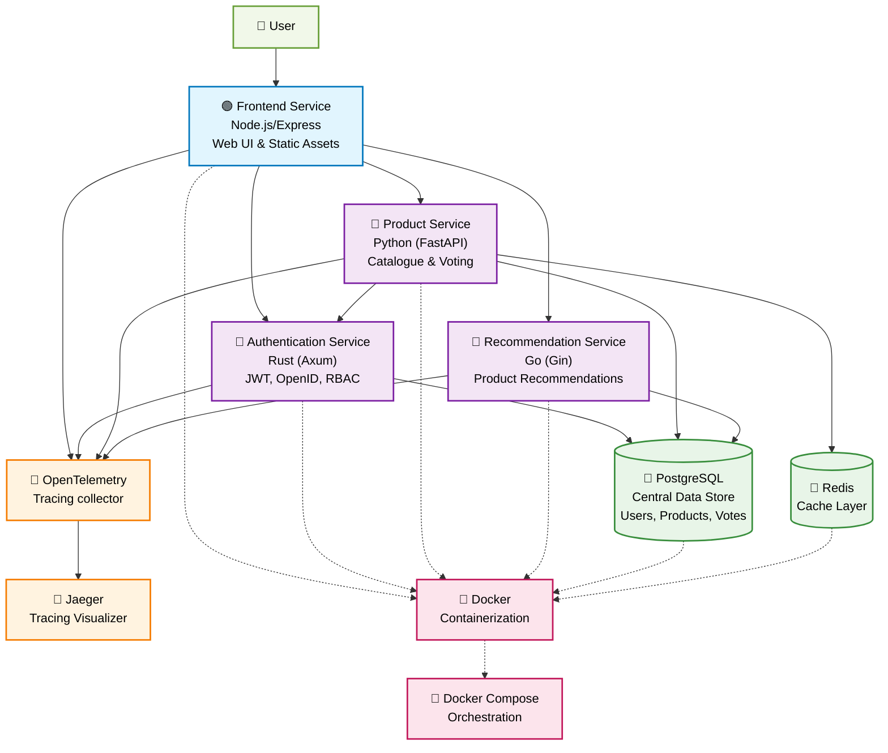

# 🚀 Microservices Showcase: A DevOps Journey

This repository showcases the evolution of a standard monolithic application into a modern,
scalable, and observable microservices architecture. It serves as a practical demonstration of my
skills in microservice design, containerization, API security, and full-stack observability.

The original [Craftista project](https://github.com/craftista/craftista) was refactored to address
performance bottlenecks, improve maintainability, and implement modern DevOps best practices. For a
detailed, chronological log of all enhancements, please see the [CHANGES.md](CHANGES.md) file.

## 🚀 Quick Start

**Prerequisites**: Docker and Docker Compose installed

```bash
# Clone and run
git clone https://github.com/AkhilManoj03/microservices-showcase.git
cd microservices-showcase
docker-compose up --build

# Access the application
open http://localhost:3000
```

## 🏛️ High-Level Architecture

The architecture is designed around a set of independent, containerized microservices that
communicate over a network. This design improves separation of concerns, enables independent
deployments, and allows for technology stack diversity. The system is fully portable and can be run
locally, on-premises, or in the cloud.



## ✨ Core Concepts Demonstrated
- **Microservices Architecture**: Decomposing a monolith into independent, specialized services.
- **Polyglot Programming**: Using the best tool for the job (Rust, Python, Go, Node.js).
- **Containerization & Orchestration**: Dockerizing all services for consistent environments and
using Docker Compose for local orchestration.
- **API Security**: Implementing JWT, JWKS, and service-to-service authentication.
- **Full-Stack Observability**: Integrating OpenTelemetry and Jaeger for distributed tracing across
all services.
- **Performance Optimization**: Leveraging Redis for caching and optimizing Docker images with
multi-stage builds.
- **Database Management**: Utilizing PostgreSQL for reliable data persistence.

## 📝 Development & Git Methodology
This project is not just a showcase of architectural patterns but also a demonstration of
professional development practices. The Git history is intentionally structured to be clean,
descriptive, and easy to follow.

-   **Story-Driven Pull Requests**: Each Pull Request (PR) is scoped to a single, significant 
eature or refactoring effort. The PRs are crafted to "tell a story," guiding the reviewer through a
logical progression of changes. You can see examples of this in the project's
[closed PRs](https://github.com/AkhilManoj03/microservices-showcase/pulls?q=is%3Apr+is%3Aclosed).

-   **Atomic & Conventional Commits**: Commits are atomic, representing one logical change at a time.
Commit messages follow a structured format that clearly identifies the scope and nature of changes:
  -   **Format**: `service: change-type: description` (e.g., `auth: feat: add JWT validation middleware`,
  `frontend: docker: optimize multi-stage build`).
  -   **Service Prefix**: Each commit starts with the service being modified (`frontend:`, `auth:`,
  `product:`, `db:`, etc.).
  -   **Technology Keywords**: Additional keywords are added when making changes to technologies
  used across multiple services (e.g., `docker:`, `otel:`, `db:`).
  -   **Clarity**: The subject line provides a concise summary, while the body offers detailed
  context, explaining the "what" and "why" of the change. This enables understanding the change
  without necessarily reading the underlying code.

-   **Reviewer-Friendly History**: By combining story-driven PRs with atomic commits, the development
process is made transparent. A reviewer can step through the commit history to understand the thought
process, making it easier to review large features without being overwhelmed.

## 🛠️ Microservice Breakdown

### 🟢 [Frontend Service](./frontend/README.md) (Node.js / Express)
The user-facing web application that consumes the backend microservices.
- **Tech Stack**: Node.js, Express, EJS.
- **Key Features**:
  - **User Interface**: Renders the UI and serves all static assets.
  - **Service Integration**: Interacts with the Authentication, Product, and Recommendation services.
  - **Secure Token Handling**: Manages JWTs received from the auth service in HTTP-only cookies.

### 🦀 [Authentication Service](./authentication/README.md) (Rust / Axum)
A self-built, high-performance, secure authentication service responsible for identity management.
- **Tech Stack**: Rust, Axum, BCrypt, JWT (RS256), PostgreSQL.
- **Key Features**:
  - Secure user registration and login with **bcrypt** password hashing.
  - **JWT (RS256)** token generation with role-based access control (RBAC).
  - Standards-based integration via **JWKS** and **OpenID Connect** endpoints.
  - **Service-to-Service Security**: Internal registration endpoint protected by a shared secret
  API key.
  - **Advanced Observability**: Full OpenTelemetry integration for distributed tracing and
  structured logging.
  - **Modular Architecture**: Refactored from a monolith for improved maintainability and clear
  separation of concerns.

### 🐍 [Product Service](./product/README.md) (Python / FastAPI)
A consolidated backend service that combines the original catalogue and voting functionalities.
- **Tech Stack**: Python, FastAPI, PostgreSQL, Redis.
- **Key Features**:
  - **Unified API**: Manages product information and user voting in a single, cohesive service.
  - **Layered Architecture**: Organized into distinct API, Core (Business Logic), and Infrastructure
  layers for scalability.
  - **Performance Caching**: Implemented a **Redis** caching layer to reduce database load and
  improve API response times.
  - **Secure Endpoints**: Validates JWTs from the Authentication Service to protect sensitive
  actions that insert into the database.

### 🐹 [Recommendation Service](./recommendation/README.md) (Go)
A lightweight, efficient service for providing product recommendations.
- **Tech Stack**: Go PostgreSQL.
- **Key Features**:
  - **Modernized Configuration**: Utilizes environment variables instead of static config files,
  following 12-factor app principles.
  - **Direct Database Access**: Fetches product data directly from PostgreSQL for real-time
  recommendations.
  - **Modular API Structure**: Code is organized into logical packages (`home`, `status`, `origami`)
  for clarity.
  - **Optimized for Docker**: Supports multi-architecture builds.

## ⚙️ Core Infrastructure & Tooling
This project relies on several key infrastructure components and tools to ensure data persistence,
performance, and observability.

### 🐘 [PostgreSQL](./database/README.md): Data Persistence
-   **Role**: Serves as the central relational database for the entire system.
-   **Responsibilities**: Stores all critical data, including user credentials (for the
Authentication Service) and product information (for Product Service and Recommendation Service).
-   **Initialization**: A dedicated [`init-db.sql`](./database/init-db.sql) script creates the
necessary schemas and populates the `products` table, ensuring a consistent starting state for all
services.

### 📕 Redis: Performance Caching
-   **Role**: Acts as an in-memory data store to cache frequently accessed data.
-   **Implementation**: Integrated with the **Product Service** to cache individual product data.
-   **Strategy**: Implements a **Cache-Aside (Lazy Loading)** pattern.
    -   **On Read**: When product data is requested, the service first checks Redis. A cache hit
    returns the data immediately. On a cache miss, the service queries PostgreSQL, stores the result
    in Redis for subsequent requests, and then returns the data.
    -   **On Write**: When a vote is added, the write operation is sent to PostgreSQL, and the
    corresponding product entry in the Redis cache is **invalidated**. This ensures data consistency.
-   **Benefit**: This strategy significantly reduces database load for frequent reads, improves API
response times, and maintains data consistency without the complexity of other caching patterns.

### 🔭 [OpenTelemetry & 🐾 Jaeger](./opentelemetry/README.md): Full-Stack Observability
-   **Role**: Provides a comprehensive solution for distributed tracing and system monitoring.
-   **OpenTelemetry**:
    -   **Implementation**: Integrated across all microservices (Frontend, Auth, Product,
    Recommendation) to generate and export traces.
    -   **Function**: Acts as the standardized layer for creating and managing telemetry data
    (traces, metrics, logs). An OTEL Collector is configured to receive this data.
-   **Jaeger**:
    -   **Implementation**: Deployed as a containerized service that receives trace data from the
    OpenTelemetry Collector.
    -   **Function**: Provides a powerful UI to visualize end-to-end request flows across all
    microservices, allowing for easy bottleneck identification, latency analysis, and error debugging.
-   **Benefits**:
    -   **End-to-End Visibility**: Trace requests as they flow through multiple services, making it
    easy to understand complex interactions and dependencies in a distributed system.
    -   **Faster Root Cause Analysis**: Quickly pinpoint where failures, errors, or slowdowns
    occur—whether in a specific service, database call, or external dependency.
    -   **Performance Optimization**: Identify bottlenecks and latency hotspots across service
    boundaries, enabling targeted performance improvements.

## 🚀 Key Architectural Improvements

### 1. Docker & Containerization Optimization
Implemented multi-stage builds and moved to minimal Alpine base images across all services.
- **Authentication Service**: **71%** image size reduction (121MB → 40MB).
- **Product Service**: **85%** reduction (793MB → 120MB).
- **Recommendation Service**: **97%** reduction (782MB → 26MB).

### 2. Full-Stack Observability
Integrated **OpenTelemetry** into every service to provide end-to-end distributed tracing. This
allows for visualizing request flows, identifying performance bottlenecks, and debugging issues
across the entire distributed system with **Jaeger**.

### 3. Enhanced API Security
The system secures user data and service-to-service communication using modern standards. The
Authentication Service acts as the central authority, issuing JWTs that are validated by other
services, ensuring a zero-trust environment.
